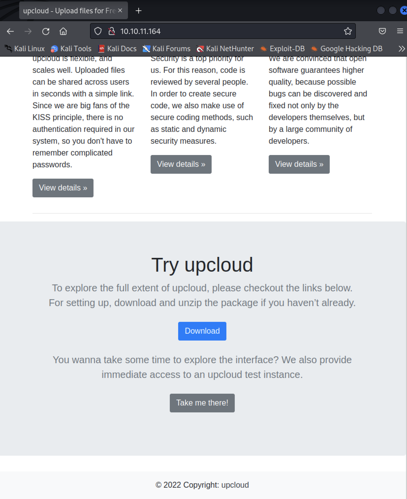

# Overview
OpenSource is an EasyBox released by HackTheBox, and is hosted on the IP address, 10.10.11.164, as of the time of attempting this box. In this box, focus is placed on exploiting the functionalities that were provided by git.
# Enumeration
## Nmap Output
We attempt to scan the IP address provided to get a better idea of the open ports. For this, we used the command `nmap -sC -sV 10.10.1.164` . Modifications were made for the screenshot due to the large output generated.

## Gobuster Output
We did not attempt to brute force the directory discovery process as we were able to get our hands on the source code for the box, and it turned out to not be a rabbit hole.
## Visiting the webpage
When visiting the webpage hosted by the server, some of the interesting discoveries that we made were 
1. the source code of upcloud, the webpage that we are currently visiting can be downloaded and run via Docker
2. There exists a file upload functionality at `/upcloud` 

## Exploring the Source Code
Aside from the links that can be reached via the webpage itself, the source code also uncovered a hidden link at `/uploads`.  

The sanitisation attempt for file paths were pathetic as best as it only filters out `../` as seen in the screenshot below. This can be bypassed easily using `..//` as the file paths would then be evaluated as absolute paths by the system.

Important note: When I went down the path of exploiting the LFI, I went the direction of attempting the gain access to a foothold via the Werkzeug debugger which houses a console. The LFI enabled me to calculate the pin that led to access to an interactive console. Here, we are able to execute a python reverse shell into the Docker container However, I ended up being stuck in a Docker container, with no idea of escaping.

Important note 2: I found out later on in the box, that we needed to use the foothold that we achieved earlier to execute chiesel so that we are able to access the contents behind port 3000.

## Exploring the sub branches
During the course of enumerating the source code, we were able to uncover a sub-branch, dev. We were able to uncover a settings.json file from the git history that exposes the user cred, dev01:Soulless_Developer#2022

# User Flag
With the source code not giving any hints, we turned to port 3000. As noted above, traffic in this port is filtered. One strategy that we attempted was to use chisel, a TCP/UDP tunnel. The general idea is to attempt to tunnel the traffic from port 3000 via the server's localhost to our own localhost.

We uploaded chisel via the upcloud functionality and executed it via the reverse shell that we achieved earlier. We ran the following chiesel commands in the attacker and victim machines.

### Attacker command
`./chiesel server --port 8000 --reverse

### Victim command 
`./chiesel client <my-port>:8000 R:3000:172.17.0.1:3000`

## First User Creds
Apparently, port 3000 was hosting a gitea app. Using the user creds that we obtained in the dev sub-branch we were able to login as dev01. Exploring the home-backup repo gives us the `id_rsa` private key, which enabled us to login as the user dev01 and capture the user flag.
# Root Flag

We were able to observe a git commit performed automatically whenever changes were made to the user's directory, as seen below.
  

A bit of googling around led us to the git hooks, which are scripts that run automatically whenever an event occurs. An example of an event would be `git commit`. 

The logic of our payload would be as such.
1. Modify the hooks such that it creates a reverse shell by root using the `pre-commit` hook.
2. Create a temporary file in the user directory to trigger the auto commit and set up a netcat listener.
3. Hopefully, the reverse shell is executed and we gain access to root.

This approach worked and we were able to gain access to the root shell.
  

